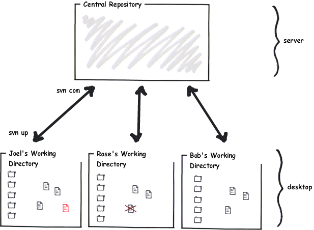
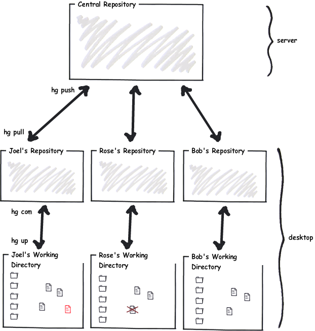

When the programmers at my company decided to switch from Subversion to Mercurial, _boy_ was I confused.

First, I came up with all kinds of stupid reasons why we shouldn't switch. “We have to keep the repository on a central server, so it will be safe,” I said. You know what? I was wrong. In Mercurial every developer has a copy of the entire repository on their hard drive. It's actually _safer_. And anyway, almost every Mercurial team uses a central repository, too, which you can back up compulsively, and you can build a three-ringed security zone complete with layers of Cylons, Stormtroopers, and adorable labradoodles (or whatever your IT department requires).

“The trouble with distributed version control is that it makes it too easy to branch,” I said, “and branching always causes problems.” Turns out this was wrong, too. I was on a streak. Branching causes problems _in Subversion_ because _Subversion_ doesn't store enough information to make _merging_ work. In _Mercurial,_ merging is painless and easy, and so branching is commonplace and harmless.

Then I said, “Fine, I'll use it, but don't expect me to be able to figure it out.” And I asked Jacob to make me a cheat sheet listing all the things that I normally did in Subversion, and the equivalent way to do them in Mercurial.

Now, I could show you this cheat sheet, but I won't, because it messed up my brain for months.

It turns out that if you've been using Subversion, your brain is a little bit, um, how can I say this politely? You're brain damaged. No, that's not polite. You need a little re-education. I walked around brain damaged for six months thinking that Mercurial was _more_ complicated than Subversion, but that was only because I didn't understand how it really worked, and once I did, it turns out—hey presto!—it's really kind of simple.

So I wrote this tutorial for you, in which I have been very careful _not_ to explain things in terms of Subversion, because there is just no reason to cause any more brain damage. The world is brain damaged enough. Instead, for those of you who are coming from Subversion, I've got this one chapter at the beginning that will try to reverse as much damage as possible so that you can learn Mercurial from a clean slate.

**If you've never used Subversion, you can skip ahead to the next chapter ( [Ground Up Mercurial](01.html)) without missing anything.**

Ready? OK, let's start with a short quiz.

**Question 1.** Do you write perfect code the first time?

If you answered “Yes” to question 1, you're a liar and a cheat. You fail. Take the test again.

New code is buggy. It takes a while to get it working respectably. In the meantime, it can cause trauma for the other developers on the team.

Now, here's how Subversion works:

- When you check new code in, everybody else gets it.

Since all new code that you write has bugs, you have a choice.

- You can check in buggy code and drive everyone else crazy, or
- You can avoid checking it in until it's fully debugged.

Subversion always gives you this horrible dilemma. Either the repository is full of bugs because it includes new code that was just written, _or_ new code that was just written is not in the repository.

As Subversion users, we are so used to this dilemma that it's hard to imagine it not existing.

Subversion team members often go days or weeks without checking anything in. In Subversion teams, newbies are terrified of checking any code in, for fear of breaking the build, or pissing off Mike, the senior developer, or whatever. Mike once got so angry about a checkin that broke the build that he stormed into an intern's cubicle and swept off all the contents of his desk and shouted, “This is your last day!” (It wasn't, but the poor intern practically wet his pants.)

All this fear about checkins means people write code for weeks and weeks _without the benefit of version control_ and then go find someone senior to help them check it in. Why have version control if you can't use it?

Here's a simple illustration of life under Subversion:

In Mercurial, _every developer has their own repository, living on their desktop:_

So you can commit your code to your private repository, and get all the benefit of version control, whenever you like. Every time you reach a logical point where your code is a little bit better, you can commit it.

Once it's solid, and you're willing to let other people use your new code, you _push_ your changes from your repository to a central repository that everyone else pulls from, and they finally see your code. When it's ready.

_Mercurial separates the act of committing new code from the act of inflicting it on everybody else._

And that means that you can commit ( **hg com**) without anyone else getting your changes. When you've got a bunch of changes that you like that are stable and all is well, you push them ( **hg push**) to the main repository.

## One more big conceptual difference

You know how every single street has a name?

Well, yeah, turns out that in Japan, not so much. They usually just number the [blocks](http://sivers.org/jadr) in between the streets, and only very, very important streets get names.

There's a similar difference between Subversion and Mercurial.

Subversion likes to think about _revisions_. A revision is what the entire file system looked like at some particular point in time.

In Mercurial, you think about _changesets._ A changeset is a concise list of the changes between one revision and the next revision.

Six of one, half dozen of the other: what's the difference?

Here's the difference. Imagine that you and I are working on some code, and we branch that code, and we each go off into our separate workspaces and make lots and lots of changes to that code separately, so they have diverged quite a bit.

When we have to merge, Subversion tries to look at both revisions—my modified code, and your modified code—and it tries to guess how to smash them together in one big unholy mess. It usually fails, producing pages and pages of “merge conflicts” that aren't really conflicts, simply places where Subversion failed to figure out what we did.

By contrast, while we were working separately in Mercurial, Mercurial was busy keeping a _series of changesets_. And so, when we want to merge our code together, Mercurial actually has a whole lot more information: it knows _what each of us changed_ and can _reapply those changes_, rather than just looking at the final product and trying to guess how to put it together.

For example, if I change a function a little bit, and then move it somewhere else, Subversion doesn't really remember those steps, so when it comes time to merge, it might think that a new function just showed up out of the blue. Whereas Mercurial will remember those things separately: function changed, function moved, which means that if you _also_ changed that function a little bit, it is much more likely that Mercurial will successfully merge our changes.

Since Mercurial thinks of everything in terms of changesets, you get to do interesting things with those changesets. You can push them to a friend on the team to try them out, instead of pushing them to the central repository and inflicting them on everybody.

If this all seems a bit confusing, don't worry—by the time you get through this tutorial, it'll all make perfect sense. For now the most important thing to know is that because Mercurial thinks in terms of “changesets” instead of “revisions” _it can merge code much better than Subversion_.

And that means that _you can feel free to branch_ because the merge isn't going to be a nightmare.

Want to know something funny? Almost every Subversion team I've spoken to has told me some variation on the very same story. This story is so common I should just name it “Subversion Story #1.” The story is this: at some point, they tried to branch their code, usually so that the shipping version which they gave their customers can be branched off separately from the version that the developers are playing with. And every team has told me that when they tried this, it worked fine, _until they had to merge_, and then it was a nightmare. What should have been a five minute process ended up with six programmers around a single computer working for two weeks trying to manually reapply every single bug fix from the stable build back into the development build.

And almost every Subversion team told me that they vowed “never again,” and they swore off branches. And now what they do is this: each new feature is in a big #ifdef block. So they can work in one single trunk, while customers never see the new code until it's debugged, and frankly, that's ridiculous.

Keeping stable and dev code separate is _precisely what source code control is supposed to let you do_.

When you switch to Mercurial, you may not even realize it, but branching becomes possible again, and you don't have to be afraid.

That means you can have team repositories, where a small team of programmers collaborates on a new feature, and when they're done, they merge it into the main development repository, and _it works!_

That means you can have a QA repository that lets the QA team try out the code. If it works, the QA team can push it up to the central repository, meaning, the central repository always has solid, tested code. And _it works!_

That means you can run experiments in separate repositories, and if they work, you can merge them into the main repository, and if they don't work, you can abandon them, and _it works!_

## One last big conceptual difference

The last major conceptual difference between Subversion and Mercurial is not as big a deal, but it will trip you up if you're not aware of it, and here it is:

Subversion is basically revision control for _files,_ but in Mercurial, revision control always applies to an entire directory—including all subdirectories.

The main way you notice this is that in Subversion, if you go into a subdirectory and commit your changes, it only commits changes in that subdirectory and all directories below it, which potentially means you've forgotten to check something in that lives in some other subdirectory which also changed. Whereas, in Mercurial, all commands always apply to the entire tree. If your code is in **c:\\code**, when you issue the **hg commit** command, you can be in **c:\\code** or in _any subdirectory_ and it has the same effect.

This is not a big deal, but if you're used to having one big gigantic repository for the whole company, where some people only check out and work on subdirectories that they care about, this isn't a very good way to work with Mercurial—you're better off having lots of smaller repositories for each project.

## And finally…

Here's the part where you're just going to have to take my word for it.

Mercurial is better than Subversion.

It is a better way of working on source code with a team. It is a better way of working on source code by yourself.

It is just _better._

And, mark my words, if you understand the way Mercurial works, and you work the way Mercurial works, and you don't try to fight it, and you don't try to do things the old Subversion way using Mercurial but instead you learn to work the way Mercurial expects you to work, you will be happy, successful, and well-fed, and you'll always be able to find the remote control to the TV.

And in the early days, you will be tempted, I know you will, to give up on Mercurial and go back to Subversion, because it will be strange, like living in a foreign country, and you'll be homesick, and you will come up with all kinds of rationalizations, like, for example, you will claim that Mercurial working directories take up too much disk space, which is bologna, because, actually, they usually take up less space than Subversion directories. (It's true!)

And then you'll go back to Subversion because you tried to branch the Subversion way, and you got confused, and it didn't work so well, because you really should have been branching the Mercurial way, by cloning repositories, not by trying to do the things that work in Subversion, but by learning the Mercurial way of doing things, which, trust me, _works._

And then you'll get Jacob, or whoever the equivalent of Jacob is at your office, to give you the “Subversion to Mercurial cheat sheet,” and you'll spend three months thinking that **hg fetch** is just like **svn up**, without really knowing what **hg fetch** does, and one day, things will go wrong and you'll blame Mercurial, when you really should be blaming yourself for not understanding how Mercurial works.

I know you'll do that because that is what I did.

Don't make the same mistake. Learn Mercurial, trust Mercurial, and figure out how to do things the Mercurial way, and you will move an entire generation ahead in source code control. While your competitors are busy taking a week to resolve all the merge conflicts they got when a vendor updated a library, you're going to type **hg merge** and say to yourself, “Oh gosh, that's cool, it just worked.” And Mike will chill out and share a doobie with the interns, and soon it will be spring and the kids at the nearby college will trade in their heavy parkas for skimpy A&F pre-torn T-shirts, and life will be good.

**hg fetch** is just like **svn up**, without really knowing what **hg fetch** does, and one day, things will go wrong and you'll blame Mercurial, when you really should be blaming yourself for not understanding how Mercurial works.

I know you'll do that because that is what I did.

Don't make the same mistake. Learn Mercurial, trust Mercurial, and figure out how to do things the Mercurial way, and you will move an entire generation ahead in source code control. While your competitors are busy taking a week to resolve all the merge conflicts they got when a vendor updated a library, you're going to type <strong>hg merge</strong> and say to yourself, “Oh gosh, that's cool, it just worked.” And Mike will chill out and share a doobie with the interns, and soon it will be spring and the kids at the nearby college will trade in their heavy parkas for skimpy A&amp;F pre-torn T-shirts, and life will be good.
