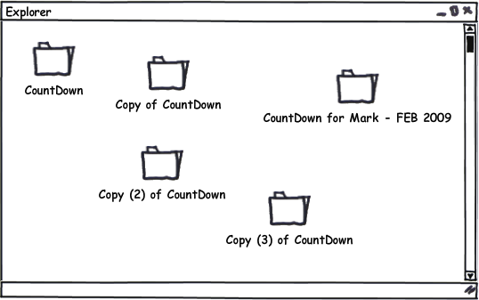
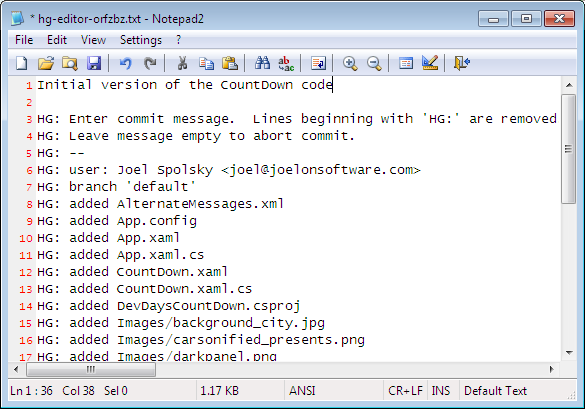
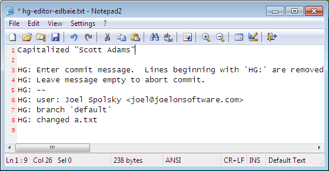
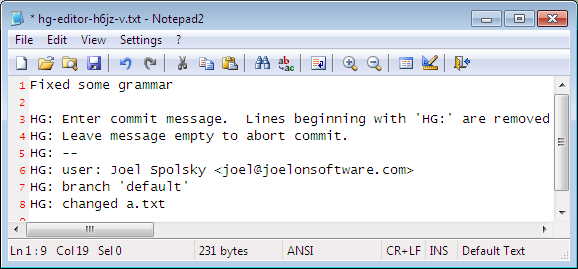

Mercurial is a _version control system_. Developers use it to manage source code.
It serves two important purposes:

1. It keeps track of every old version of every file
2. It can merge different versions of your code, so that teammates can work independently on the code and then merge their changes

Without Mercurial, you could try to keep old versions
just by making a lot of copies of the directory containing all your code:

This is tedious, takes up a lot of disk space, and confusing. Using version control is a better way to do this.

Most people work with Mercurial through the command line, which works on Windows, Unix, and Mac. The command for Mercurial is **hg**:

<pre><samp>
c:\hginit> <kbd>hg</kbd>
Mercurial Distributed SCM
basic commands:
add        add the specified files on the next commit
annotate   show changeset information by line for each file
clone      make a copy of an existing repository
commit     commit the specified files or all outstanding changes
diff       diff repository (or selected files)
export     dump the header and diffs for one or more changesets
forget     forget the specified files on the next commit
init       create a new repository in the given directory
log        show revision history of entire repository or files
merge      merge working directory with another revision
pull       pull changes from the specified source
push       push changes to the specified destination
remove     remove the specified files on the next commit
serve      export the repository via HTTP
status     show changed files in the working directory
summary    summarize working directory state
update     update working directory
use "hg help" for the full list of commands or "hg -v" for details
</samp></pre>
  
Typing **hg** without anything else gives you a list of the most common commands that are available. You can also try **hg help** for a complete list of commands.

To take advantage of version control, you needed a _repository_. A repository stores all your old versions of every file. To save disk space, it’s not actually going to store every old version—it’s just going to store a compact list of changes.

In the old days, getting a repository was a big deal. You had to have a central server somewhere and you had to install software on it. Mercurial is _distributed_, so you can use it without a fancy central server. You can run it entirely on your own computer. And getting a repository is super-easy: you just go into the top-level directory where all your code lives…

<pre><samp>
c:\hginit> <kbd>cd CountDown</kbd>
c:\hginit\CountDown> dir /w</kbd>
 Volume in drive C has no label.
 Volume Serial Number is 9862-36C5
 Directory of c:\hginit\CountDown
[.]                       [..]                      a.txt
AlternateMessages.xml     App.config                App.xaml
App.xaml.cs               CountDown.xaml            CountDown.xaml.cs
DevDaysCountDown.csproj   favicon.ico               [Images]
[Properties]              [TweetSharp]
               9 File(s)        155,932 bytes
               5 Dir(s)  76,083,609,600 bytes free
</samp></pre>

  … there’s my code, and you type hg init:

<section aria-labelled-by="tip-hg-init" class="cheatcontent" style="margin-top:-50px">
  <dfn><h4 id="tip-hg-init">hg init</h4></dfn>
  
 creates a repository

</section>

<pre><samp>
c:\hginit\CountDown> <kbd>hg init</kbd>
c:\hginit\CountDown> 
</samp></pre>

Wait a minute, did anything happen? It doesn’t look like anything happened. But if you look closely, you’ll see that there’s a new directory there, named **.hg**:

<pre><samp>
c:\hginit\CountDown> <kbd>dir /w</kbd>
Volume in drive C has no label.
Volume Serial Number is 9862-36C5
Directory of c:\hginit\CountDown
[.]                       [..]                      [.hg]
a.txt                     AlternateMessages.xml     App.config
App.xaml                  App.xaml.cs               CountDown.xaml
CountDown.xaml.cs         DevDaysCountDown.csproj   favicon.ico
[Images]                  [Properties]              [TweetSharp]
               9 File(s)        155,932 bytes
               6 Dir(s)  76,083,650,560 bytes free
</samp></pre>
That’s the repository! It’s a directory full of everything Mercurial needs. Settings, old version of files, tags, an extra pair of socks for when it rains, etc. _Don’t go in there._ You are almost never going to want to mess with that directory directly.

OK, now that we have a fresh new repository, we’re going to want to add all these source files to it. That’s easy, too: just type **hg add**.

<section aria-labelled-by="tip-hg-add" class="cheatcontent" style="margin-top:-60px">
  <dfn><h4 id="tip-hg-add">hg add</h4></dfn>
  
 schedules files to be added to the repository. They won’t actually be added until you commit

</section>

<pre><samp>
c:\hginit\CountDown> <kbd>hg add</kbd>
adding AlternateMessages.xml
adding App.config
adding App.xaml
adding App.xaml.cs
adding CountDown.xaml
adding CountDown.xaml.cs
adding DevDaysCountDown.csproj
adding Images\background_city.jpg
adding Images\carsonified_presents.png
adding Images\darkpanel.png
adding Images\devdays.png
adding Images\failwhale.png
adding Images\holding_image.jpg
adding Images\jeff_atwood.jpg
adding Images\joel_spolsky.jpg
adding Images\logo_stackoverflow.png
adding Images\matt_lacey.jpg
adding Images\sideDarkpanel.png
adding Images\vertical_lines2.png
adding Properties\AssemblyInfo.cs
adding Properties\Resources.Designer.cs
adding Properties\Resources.resx
adding Properties\Settings.Designer.cs
adding Properties\Settings.settings
adding TweetSharp\Dimebrain.TweetSharp.dll
adding TweetSharp\Dimebrain.TweetSharp.xml
adding TweetSharp\Newtonsoft.Json.dll
adding a.txt
adding favicon.ico
</samp></pre>
There’s still one more step… you have to _commit_ your changes. What changes? The change of adding all those files.

Why do you have to commit? With Mercurial, committing says “hey, the way the files look right now—please remember that.” It’s like making a copy of the whole directory… every time you have something that you’ve changed that you sorta like, you commit.
  
<section aria-labelled-by="tip-hg-commit" class="cheatcontent" style="margin-top:-80px">
  <dfn><h4 id="tip-hg-commit">hg commit</h4></dfn>
  
 saves the current state of all files to the repository

</section>
  
<pre><samp>
c:\hginit\CountDown> <kbd>hg commit</kbd>
</samp></pre>
Mercurial will pop up an editor so that you can type a commit message. This is just something you type to remind yourself of what changed in this commit.

When you save and exit, your files will be committed.

You can type **hg log** to see a history of changes. It’s like your repository’s blog:

<section aria-labelled-by="tip-hg-log" class="cheatcontent" style="margin-top:-50px">
  <dfn><h4 id="tip-hg-log">hg log</h4></dfn>
  
 shows the history of changes committed to the repository

</section>

<pre><samp>
c:\hginit\CountDown> <kbd>hg log</kbd>
changeset:   0:da5f372c3901
tag:         tip
user:        Joel Spolsky &lt;joel@joelonsoftware.com&gt;
date:        Fri Feb 05 13:04:30 2010 -0500
summary:     Initial version of the CountDown code
</samp></pre>

Let’s edit a file and see what happens.

<section class="diff">
<h3>a.txt</h3>

<del>Scott Adams</del><ins>SCOTT ADAMS</ins>: Normal people believe that if it ain't
broke, don't fix it. Engineers believe that if it
ain't broke, it doesn't have enough features yet.

</section>

Now that we’ve made another change, we can commit it using **hg commit**:

<pre><samp>
c:\hginit\CountDown> <kbd>hg commit</kbd>

</samp></pre>

Notice that Mercurial has figured out that only one file, a.txt, changed:

And now that I’ve committed, let’s take a look at the log:

<pre><samp>
c:\hginit\CountDown> <kbd>hg log</kbd>
changeset:   1:a9497f468dc3
tag:         tip
user:        Joel Spolsky &lt;joel@joelonsoftware.com&gt;
date:        Fri Feb 05 13:26:13 2010 -0500
summary:     Capitalized "Scott Adams"
changeset:   0:da5f372c3901
user:        Joel Spolsky &lt;joel@joelonsoftware.com&gt;
date:        Fri Feb 05 13:04:30 2010 -0500
summary:     Initial version of the CountDown code
</samp></pre>

Like any modern blogger, Mercurial puts the newest stuff on top.

I’m going to make one more change, just to amuse myself.

<section class="diff">
<h3>a.txt</h3>

SCOTT ADAMS: Normal people believe that if it <del>ain't broke</del><ins>isn't broken</ins>,
don't fix it. Engineers believe that if it
<del>ain't broke</del><ins>isn't broken</ins>, it doesn't have enough features yet.

</section>

Committing:

<pre><samp>
c:\hginit\CountDown> <kbd>hg commit</kbd>
</samp></pre>
My commit message:

And now what does the log show?
<pre><samp>
c:\hginit\CountDown> <kbd>hg log</kbd>
changeset:   2:55490459b740
tag:         tip
user:        Joel Spolsky &lt;joel@joelonsoftware.com&gt;
date:        Fri Feb 05 13:47:43 2010 -0500
summary:     Fixed some grammar
changeset:   1:a9497f468dc3
user:        Joel Spolsky &lt;joel@joelonsoftware.com&gt;
date:        Fri Feb 05 13:26:13 2010 -0500
summary:     Capitalized "Scott Adams"
changeset:   0:da5f372c3901
user:        Joel Spolsky &lt;joel@joelonsoftware.com&gt;
date:        Fri Feb 05 13:04:30 2010 -0500
summary:     Initial version of the CountDown code
</samp></pre>

OK, that was a lot of fun. I made some changes, and each time
I made a significant change, I committed it to the repository.

I know what you’re thinking. You’re thinking, “JOEL, THIS ALL SEEMS LIKE A BIG WASTE OF TIME.”
Why go through all this rigamarole of committing?

Patience, young grasshopper. You’re about to learn how to get some benefit out of this.

Number one. Let’s say you make a huge mistake editing.

<section class="diff">
<h3>a.txt</h3>

<del>SCOTT ADAMS: Normal people believe that if it isn't broken, don't fix it. Engineers believe that if it isn't broken, it doesn't have enough features yet.</del>
<ins>DAN QUAYLE: Illegitimacy is something we should talk about in terms of not having it.</ins>

</section>

And then, gosh, just for good measure you delete a couple of
really important files.
<pre><samp>
c:\hginit\CountDown> <kbd>del favicon.ico</kbd>
c:\hginit\CountDown> <kbd>del App.xaml</kbd>
</samp></pre>
In the days before Mercurial, this would be a good opportunity to go crying
to the system administrator and asking piercingly sad questions about
_why_ the backup system is “temporarily” out of commission and has been
for the last eight months.

The system administrator, whom everybody calls Taco, is too shy to eat lunch
with the rest of the team. On those rare occasions where he is away from his swivel office
chair, you will notice a triangular-shaped salsa-colored stain on the seat where
drippings of his many Mexican lunches fell between his legs, insuring that nobody takes
his chair, even though it is the superior Herman Miller variety that the company founders bought
themselves, not the standard-issue Staples $99 special that causes everyone else
back pain.

Anyway, yeah, there’s no backup.

Thanks to Mercurial, though, when you’re unhappy with your changes, you can just issue
the handy command **hg revert** which will immediately revert
your directory back to the way it was at the time of the last commit.

<section aria-labelled-by="tip-hg-revert" class="cheatcontent" style="margin-top:-80px">
  <dfn><h4 id="tip-hg-revert">hg revert</h4></dfn>
  
 revert changed files back to committed version

</section>

<pre><samp>
c:\hginit\CountDown> <kbd>hg revert --all</kbd>
reverting App.xaml
reverting a.txt
reverting favicon.ico
c:\hginit\CountDown> <kbd>type a.txt</kbd>
SCOTT ADAMS: Normal people believe that if it isn't
broken, don't fix it. Engineers believe that if it
isn't broken, it doesn't have enough features yet.
</samp></pre>

I used the command line argument **`--` all** because I wanted
to revert _all_ files back to their original state.

So, when you’re working on source code with Mercurial:

1. Make some changes
2. See if they work
3. If they do, **commit** them
4. If they don’t, **revert** them
5. GOTO 1

(I know. Between the Windows command prompt and the GOTO statements, I am the _least cool programmer_ who ever lived.)

<section aria-labelled-by="tip-hg-status" class="cheatcontent" style="margin-top:-10px">
  <dfn><h4 id="tip-hg-status">hg status</h4></dfn>
  
 shows a list of changed files

</section>

As time goes on, you may get confused about where you are and what
changes you’ve made since the last commit. Mercurial keeps
track of all that for you. All you have to do is type **hg status** and
Mercurial will give you a list of files that have changed.

Suppose I create a file, edit a file, and delete a file.

<pre><samp>
c:\hginit\CountDown> <kbd>copy a.txt b.txt</kbd>
    1 file(s) copied.
c:\hginit\CountDown> <kbd>notepad2 a.txt</kbd>
c:\hginit\CountDown> <kbd>del favicon.ico</kbd>
c:\hginit\CountDown> <kbd>hg status</kbd>
M a.txt
! favicon.ico
? b.txt
</samp></pre>

**hg status** lists any files that have changed with a little letter at
the beginning of the line telling you what’s up. “M” means “Modified”—the file has been changed. “!” means missing—the file is supposed to be there, but it disappeared.
“?” means unknown—Mercurial doesn’t know anything about this file. Yet.

Let’s deal with these changes one at a time. That modified file, **a.txt**.
What’s modified about it? You may have forgotten what you changed! Heck, I can
barely even remember what I ate for breakfast most days. Which is especially worrisome
because it’s ALWAYS CHEERIOS. Anyway, a.txt has changed. What changed?

There’s a command for that: **hg diff** tells you exactly what’s changed
with a file since the last commit.

<section aria-labelled-by="tip-hg-diff" class="cheatcontent" style="margin-top:-50px">
  <dfn><h4 id="tip-hg-diff">hg diff</h4></dfn>
  
 shows what changed in a file

</section>

<pre><samp>
c:\hginit\CountDown> <kbd>hg diff a.txt</kbd>
diff -r 55490459b740 a.txt
--- a/a.txt     Fri Feb 05 13:47:43 2010 -0500
+++ b/a.txt     Fri Feb 05 14:31:18 2010 -0500
@@ -1,3 +1,3 @@
-SCOTT ADAMS: Normal people believe that if it isn't
+SCOTT ADAMS: Civilians believe that if it isn't
 broken, don't fix it. Engineers believe that if it
 isn't broken, it doesn't have enough features yet.
</samp></pre>

This format is a little bit cryptic, but the interesting part
is that you can see some lines that begin with a minus,
which were removed, and lines that begin with a plus, which
were added, so you can see here that “Normal people” was edited to be “Civilians”.

<section aria-labelled-by="tip-hg-remove" class="cheatcontent" style="margin-top:-10px">
  <dfn><h4 id="tip-hg-remove">hg remove</h4></dfn>
  
 schedules files to be removed from
    the repository. They won't actually
    be removed until you commit.

</section>

Now. That missing file, favicon.ico. As earlier, if you didn’t mean to
delete it, you can **hg revert**, but let’s assume you really did mean
to remove it. Whenever you remove (or add) a file, you have to tell Mercurial:

<pre><samp>
c:\hginit\CountDown> <kbd>hg remove favicon.ico</kbd>
c:\hginit\CountDown> <kbd>hg status</kbd>
M a.txt
R favicon.ico
? b.txt
</samp></pre>

The “R” means “Removed” so the next time we commit in Mercurial this file will be
removed. (The _history_ of the file will remain in the repository, so of course
we can always get it back). Finally, we need to add that new file, **b.txt**:

<pre><samp>
c:\hginit\CountDown> <kbd>hg add</kbd>
adding b.txt
c:\hginit\CountDown> <strong>hg st</strong>
M a.txt
A b.txt
R favicon.ico
</samp></pre>

“A” means “Added.” Did you notice I was getting lazy about typing out
**hg status** all the time? Mercurial only needs enough letters
to disambiguate, and there are no other commands that start with **st**.

Having solved all the little ?’s and !’s, I can go ahead and check in my changes:

<pre><samp>
c:\hginit\CountDown> <kbd>hg commit</kbd>
c:\hginit\CountDown> <kbd>hg log</kbd>
changeset:   3:2f4718ee168e
tag:         tip
user:        Joel Spolsky &lt;joel@joelonsoftware.com&gt;
date:        Fri Feb 05 14:54:45 2010 -0500
summary:     A few highly meaningful changes. No favicon.ico no more.

changeset:   2:55490459b740
user:        Joel Spolsky &lt;joel@joelonsoftware.com&gt;
date:        Fri Feb 05 13:47:43 2010 -0500
summary:     Fixed some grammar

changeset:   1:a9497f468dc3
user:        Joel Spolsky &lt;joel@joelonsoftware.com&gt;
date:        Fri Feb 05 13:26:13 2010 -0500
summary:     Capitalized "Scott Adams"

changeset:   0:da5f372c3901
user:        Joel Spolsky &lt;joel@joelonsoftware.com&gt;
date:        Fri Feb 05 13:04:30 2010 -0500
summary:     Initial version of the CountDown code</pre>
</samp></pre>
  

One more thing about the output from
**hg log**: the _changeset_ line shows us a number
to every commit…. actually two numbers: a handy, short one, like “0” for
your initial revision, etc., and a long, goofy hexadecimal one which you can
ignore for now.

Remember that Mercurial keeps, in the repository, enough information
to reconstruct any old version of any file.

<section aria-labelled-by="tip-hg-cat" class="cheatcontent" style="margin-top:-10px">
  <dfn><h4 id="tip-hg-cat">hg cat</h4></dfn>
  
 shows any revision of any file.

</section>

First of all, the simple command **hg cat** can be used to print any old version
of a file. For example, to see what a.txt looks like now:
  

<pre><samp>
c:\hginit\CountDown> <kbd>hg cat a.txt</kbd>
SCOTT ADAMS: Civilians believe that if it isn't
broken, don't fix it. Engineers believe that if it
isn't broken, it doesn't have enough features yet.
</samp></pre>
  
To see what it looked like in the past, I can just pick a changeset number
from the log. Then I use the **cat** command
with the **-r** (“revision”) argument:

<pre><samp>
c:\hginit\CountDown> <kbd>hg cat -r 0 a.txt</kbd>
Scott Adams: Normal people believe that if it ain't
broke, don't fix it. Engineers believe that if it
ain't broke, it doesn't have enough features yet.
</samp></pre>
  

If the file is long and complicated, and only a little bit of it changed,
I can use the **hg diff** command with an **-r**
argument to print the difference between any two revisions. For example, to see
what changed between revisions 0 and 1:
  
<pre><samp>
c:\hginit\CountDown> <kbd>hg diff -r 0:1 a.txt</kbd>
diff -r da5f372c3901 -r a9497f468dc3 a.txt
--- a/a.txt     Fri Feb 05 13:04:30 2010 -0500
+++ b/a.txt     Fri Feb 05 13:26:13 2010 -0500
@@ -1,3 +1,3 @@
-Scott Adams: Normal people believe that if it ain't
+SCOTT ADAMS: Normal people believe that if it ain't
 broke, don't fix it. Engineers believe that if it
 ain't broke, it doesn't have enough features yet.
</samp></pre>
  

Finally, if you haven’t collapsed yet from exhaustion, before
I finish this tutorial, I just want to show you _one more tiny thing:_ you can use
the **hg update** command to go backwards or forwards in time
to any revision you want. Well, you can’t really go into the
future _per se_, although that would be super-cool. If you only had four revisions
you would just **hg update -r 103994** and get some really
cool anti-gravity sci-fi futuristic version of your source code.
But of course, that is not possible.

<section aria-labelled-by="tip-hg-update" class="cheatcontent" style="margin-top:-120px">
  <dfn><h4 id="tip-hg-update">hg update</h4></dfn>
  
 update the working directory to a particular revision

</section>

What is possible is going _back_ to any version. Watch:

  
  <pre><samp>
c:\hginit\CountDown> <kbd>hg update -r 0</kbd>
2 files updated, 0 files merged, 1 files removed, 0 files unresolved
c:\hginit\CountDown> type a.txt</kbd>

Scott Adams: Normal people believe that if it ain't
broke, don't fix it. Engineers believe that if it
ain't broke, it doesn't have enough features yet.

c:\hginit\CountDown> <kbd>hg up -r 1</kbd>
1 files updated, 0 files merged, 0 files removed, 0 files unresolved

c:\hginit\CountDown> type a.txt</kbd>
SCOTT ADAMS: Normal people believe that if it ain't
broke, don't fix it. Engineers believe that if it
ain't broke, it doesn't have enough features yet.

c:\hginit\CountDown> <kbd>hg up</kbd>
2 files updated, 0 files merged, 1 files removed, 0 files unresolved

c:\hginit\CountDown> type a.txt</kbd>
SCOTT ADAMS: Civilians believe that if it isn't
broken, don't fix it. Engineers believe that if it
isn't broken, it doesn't have enough features yet.
</samp></pre>
  
**hg update** is actually modifying every file in the directory that changed
to go backwards and forwards through time. If a file was added or removed, it adds or removes it.
Without any arguments, **hg update** goes to the latest version.

## Test yourself

OK! That’s it for tutorial one. Here’s all the things you should know how to do now:

1. Create a repository
2. Add and remove files in a repository
3. After making changes, see what uncommitted changes you made, then
4. … commit if you like them,
5. … or revert if you don’t.
6. See old versions of files, or even move your directory backwards and forwards in time

