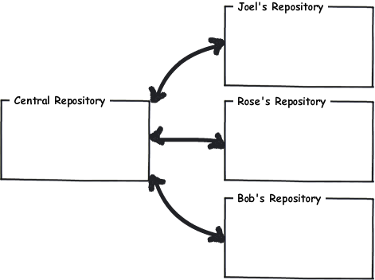
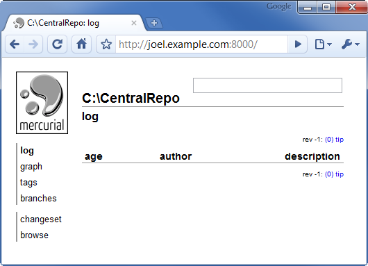
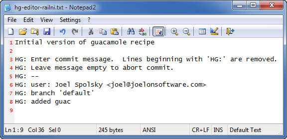
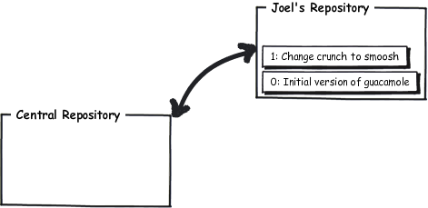
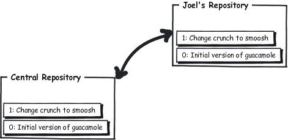
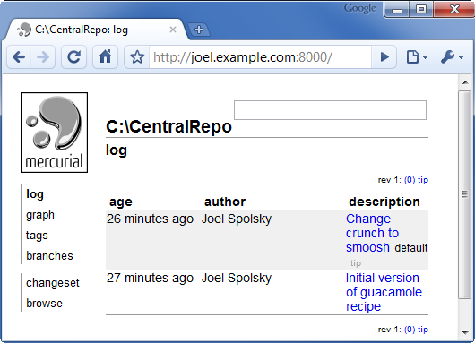
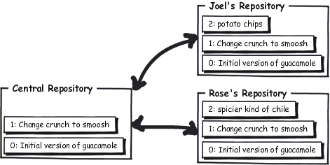
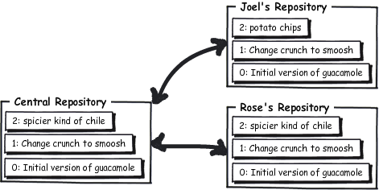
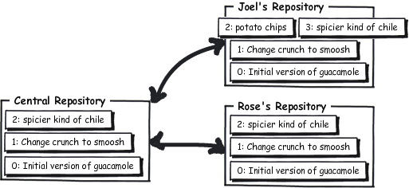
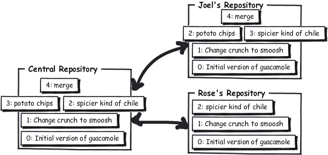

The most common way to collaborate with Mercurial is to set up a central repository, in addition to the private repositories that we each have on our own computers. We can use the central repository sort of like a swap meet, where we get together to trade the changes we’ve been making.

<section class="cheatcontent" style="margin-top:0px">
  <dfn>hg serve</dfn>
  
 runs a web server to make the current repository accessible over the Internet

</section>

The quick-and-dirty way to make a central repository is to use Mercurial’s built in web server&#8212;all you have to do is make a repository with **hg init** and then serve it on the web with **hg serve**. By default it will be served on port 8000.

<pre><samp>
C:\> <kbd>mkdir CentralRepo</kbd>

C:\> <kbd>cd CentralRepo</kbd>

C:\CentralRepo> <kbd>init</kbd>

C:\CentralRepo> <kbd>serve</kbd>
</samp></pre>

Since this computer is named **joel.example.com** I can just go to **http://joel.example.com:8000/** with a web browser and see that the server is up and running, even though the repository there is completely empty.

<section class="cheatcontent" style="margin-top:0px">
  <dfn>hg clone</dfn>
  
 make a complete copy of an entire repository

</section>

With the central web server running, I can <em>clone</em> this repository <em>from</em> the server <em>onto</em> my own computer for my own use. This repository is empty right now, so I’ll just get another empty repository when I clone it.

<pre class="joel"><samp>
C:\Users\joel> <kbd>clone http://joel.example.com:8000/ recipes</kbd>
no changes found
updating to branch default
0 files updated, 0 files merged, 0 files removed, 0 files unresolved

C:\Users\joel> <kbd>cd recipes</kbd>
C:\Users\joel\recipes> <kbd>dir</kbd>
 Volume in drive C has no label.
 Volume Serial Number is 84BD-9C2C

 Directory of C:\Users\joel\recipes

02/08/2010  02:46 PM    &lt;DIR&gt;          .
02/08/2010  02:46 PM    &lt;DIR&gt;          ..
02/08/2010  02:46 PM    &lt;DIR&gt;          .hg
               0 File(s)              0 bytes
               3 Dir(s)  41,852,125,184 bytes free
</samp></pre>

Now I’ll create a file called **guac** with my famous guacamole recipe.

<section class="diff">
<h3>guac</h3>

* 2 ripe avocados 
* 1/2 red onion, minced (about 1/2 cup) 
* 1-2 serrano chiles, stems and seeds removed, minced 
* 2 tablespoons cilantro leaves, finely chopped 
* 1 tablespoon of fresh lime or lemon juice 
* 1/2 teaspoon coarse salt 
* A dash of freshly grated black pepper 
* 1/2 ripe tomato, seeds and pulp removed, chopped  

Crunch all ingredients together. 
Serve with tortilla chips. 

</section>

I’ll add this file, and commit it as the first official version:

<pre class="joel"><samp>
C:\Users\joel\recipes><kbd>add</kbd>
adding guac

C:\Users\joel\recipes><kbd>commit</kbd>
</samp></pre>

I’ll provide a commit comment:

I’m just going to quickly edit this file and make one small change, so
that we have a little bit of history in the repository.
<section class="diff">
<h3>guac</h3>

… 
* A dash of freshly grated black pepper 
* 1/2 ripe tomato, seeds and pulp removed, chopped  

<ins>Smoosh</ins> all ingredients together. 
Serve with tortilla chips. 

</section>

And now to commit that change:

<pre class="joel"><samp>

C:\Users\joel\recipes><kbd>status</kbd>
M guac

C:\Users\joel\recipes><kbd>diff guac</kbd>
diff -r c1fb7e7fbe50 guac
--- a/guac      Mon Feb 08 14:50:08 2010 -0500
+++ b/guac      Mon Feb 08 14:51:08 2010 -0500
@@ -7,5 +7,5 @@
 * A dash of freshly grated black pepper
 * 1/2 ripe tomato, seeds and pulp removed, chopped

-Crunch all ingredients together.
+Smoosh all ingredients together.
 Serve with tortilla chips.

C:\Users\joel\recipes><kbd>hg com -m "Change crunch to smoosh"</kbd>

C:\Users\joel\recipes><kbd>hg log</kbd>
changeset:   1:a52881ed530d
tag:         tip
user:        Joel Spolsky &lt;joel@joelonsoftware.com&gt;
date:        Mon Feb 08 14:51:18 2010 -0500
summary:     Change crunch to smoosh

changeset:   0:c1fb7e7fbe50
user:        Joel Spolsky &lt;joel@joelonsoftware.com&gt;
date:        Mon Feb 08 14:50:08 2010 -0500
summary:     Initial version of guacamole recipe
</samp></pre>

Notice that when I committed that time, I used the **-m** argument, which I haven’t done before. That’s just a way to provide the commit message on the command line, without using an editor.

OK, where are we? So far, I’ve got a central repository, and my clone of it. I’ve made two changes and committed them, but those changes are only in my clone&#8212;they’re not in the central repository yet. So the world looks like this:

<section class="cheatcontent" style="margin-top:0px">
  <dfn>hg push</dfn>
  
 push new changes from this repository into another

</section>

Now I’m going to use the **hg push** command, which will push my changes from my repository into the central repository:

<pre class="joel"><samp>
C:\Users\joel\recipes><kbd>push</kbd>
pushing to http://joel.example.com:8000/
searching for changes
ssl required
</samp></pre>

Oh great. It figures that wouldn’t work. I neglected to think about the security implications of just running a random web server and allowing anybody in the world to push their stupid changes into it. Bear with me for a moment; I’m going to configure that server to allow anybody in the world to do anything they want to it. This can be done by editing the file .hg\hgrc on the server:

<section class="diff">
<h3>.hg\hgrc</h3>

[web] 
push_ssl=False 
allow_push=* 

</section>
Needless to say, this is rather unsafe, but if you’re on a nice protected LAN at work and there’s a good firewall and you trust everybody on your LAN, this is reasonably OK. Otherwise, you’ll want to read the advanced chapters on security.

OK, time to fire up the server again:

<pre><samp>
C:\CentralRepo> <kbd>hg serve</kbd>
</samp></pre>

And now I should be able to push into it:

<pre class="joel"><samp>
C:\Users\joel\recipes><kbd>push</kbd>
pushing to http://joel.example.com:8000/
searching for changes
adding changesets
adding manifests
adding file changes
added 2 changesets with 2 changes to 1 files
</samp></pre>

Yay! Now the world looks like this:

I know what you’re thinking. You’re thinking, &#8220;Gosh, Joel, that’s strange. Why do these repositories contain _changes_ as opposed to _files_? Where’s that **guac** file?&#8221;

Yeah, it’s weird. But that’s the way distributed version control works. Repositories just contain big stacks of changes. Imagine that a change is like one of those clear transparency sheets. When you have a bunch of transparency sheets, you stack them on each other in order, with the latest change on the top, and look down from above, and&#8212;tada!&#8212;you’re looking at the current version of the file. As you peel away transparencies from the top of the pile, you see older and older versions.

We can use our web browser to peek into the central repository now:

Exactly what you would expect.

Now I want Rose to help me work on the recipe. Rose is on the test team. Everyone agrees that she reminds them of those middle-aged ladies you see in Vegas, sitting there slack-jawed for hours, shoveling quarter after quarter into the slot machines, only she’s testing software. You can throw her a new version of your code and she’ll test it on 23 different Linux distros, one after the other, expressionless, unmoving, pausing only to tell you that there’s a dot missing on one of the lower-case I’s in the Turkish version on Ubuntu Linux. Rose is a great tester but I swear sometimes she acts like a zombie.

<pre class="rose"><samp>
C:\Users\rose> <kbd>clone http://joel.example.com:8000/ recipes</kbd>
requesting all changes
adding changesets
adding manifests
adding file changes
added 2 changesets with 2 changes to 1 files
updating to branch default
1 files updated, 0 files merged, 0 files removed, 0 files unresolved
</samp></pre>

Rose used the **hg clone** command to get her own, complete copy of the repository. **hg clone** takes two arguments: the URL of the repository and the name of the directory where you want it cloned. She made her own **recipes** folder.

<pre class="rose"><samp>
C:\Users\rose> <kbd>cd recipes</kbd>

C:\Users\rose\recipes> <kbd>dir</kbd>
 Volume in drive C has no label.
 Volume Serial Number is 84BD-9C2C

 Directory of C:\Users\rose\recipes

02/08/2010  03:23 PM    &lt;DIR&gt;          .
02/08/2010  03:23 PM    &lt;DIR&gt;          ..
02/08/2010  03:23 PM    &lt;DIR&gt;          .hg
02/08/2010  03:23 PM               394 guac
               1 File(s)            394 bytes
               3 Dir(s)  41,871,872,000 bytes free

C:\Users\rose\recipes> <kbd>log</kbd>
changeset:   1:a52881ed530d
tag:         tip
user:        Joel Spolsky &lt;joel@joelonsoftware.com&gt;
date:        Mon Feb 08 14:51:18 2010 -0500
summary:     Change crunch to smoosh

changeset:   0:c1fb7e7fbe50
user:        Joel Spolsky &lt;joel@joelonsoftware.com&gt;
date:        Mon Feb 08 14:50:08 2010 -0500
summary:     Initial version of guacamole recipe
</samp></pre>

Notice that when she types **hg log** she sees the whole history. She has actually downloaded the entire repository, with its complete history of everything that happened.

Rose is going to make a change, and check it in:

<section class="diff">
<h3>guac</h3>

* 2 ripe avocados 
* 1/2 red onion, minced (about 1/2 cup) 
* 1-2 <ins>habanero</ins> chiles, stems and seeds removed, minced 
* 2 tablespoons cilantro leaves, finely chopped 
* 1 tablespoon of fresh lime or lemon juice 
… 

</section>

Now she commits it. Notice that she can do this even if the server is not running: the commit entirely happens on her machine.

<pre class="rose"><samp>
C:\Users\rose\recipes> <kbd>hg diff</kbd>
diff -r a52881ed530d guac
--- a/guac      Mon Feb 08 14:51:18 2010 -0500
+++ b/guac      Mon Feb 08 15:28:57 2010 -0500
@@ -1,6 +1,6 @@
 * 2 ripe avocados
 * 1/2 red onion, minced (about 1/2 cup)
-* 1-2 serrano chiles, stems and seeds removed, minced
+* 1-2 habanero chiles, stems and seeds removed, minced
 * 2 tablespoons cilantro leaves, finely chopped
 * 1 tablespoon of fresh lime or lemon juice
 * 1/2 teaspoon coarse salt

C:\Users\rose\recipes> <kbd>hg com -m "spicier kind of chile"</kbd>

C:\Users\rose\recipes> <kbd>hg log</kbd>
changeset:   2:689026657682
tag:         tip
user:        Rose Hillman &lt;rose@example.com&gt;
date:        Mon Feb 08 15:29:09 2010 -0500
summary:     spicier kind of chile

changeset:   1:a52881ed530d
user:        Joel Spolsky &lt;joel@joelonsoftware.com&gt;
date:        Mon Feb 08 14:51:18 2010 -0500
summary:     Change crunch to smoosh

changeset:   0:c1fb7e7fbe50
user:        Joel Spolsky &lt;joel@joelonsoftware.com&gt;
date:        Mon Feb 08 14:50:08 2010 -0500
summary:     Initial version of guacamole recipe
</samp></pre>

While Rose was making her change, I can make a change at the same time.

<section class="diff">
<h3>guac</h3>

… 
* 1/2 ripe tomato, seeds and pulp removed, chopped  

Smoosh all ingredients together.

Serve with <ins>potato</ins> chips.

</section>

After I check that in, you’ll see that my log shows something different as changeset #2 than Rose’s log.

<pre class="joel"><samp>
C:\Users\joel\recipes><kbd>hg com -m "potato chips. No one can eat just one."</kbd>

C:\Users\joel\recipes><kbd>hg log</kbd>
changeset:   2:4ecdb2401ab4
tag:         tip
user:        Joel Spolsky &lt;joel@joelonsoftware.com&gt;
date:        Mon Feb 08 15:32:01 2010 -0500
summary:     potato chips. No one can eat just one.

changeset:   1:a52881ed530d
user:        Joel Spolsky &lt;joel@joelonsoftware.com&gt;
date:        Mon Feb 08 14:51:18 2010 -0500
summary:     Change crunch to smoosh

changeset:   0:c1fb7e7fbe50
user:        Joel Spolsky &lt;joel@joelonsoftware.com&gt;
date:        Mon Feb 08 14:50:08 2010 -0500
summary:     Initial version of guacamole recipe
</samp></pre>

Our histories are starting to diverge.

Don’t worry… in a minute we’ll see how to bring these diverging changes back together into one delicious habanero-based potato chip dip.

<section class="cheatcontent" style="margin-top:-15px">
  <dfn>hg outgoing</dfn>
  
 list changes in current repository waiting to be pushed

</section>

Rose can continue to work, disconnected, making as many changes as she wants, and either committing them, or reverting them, in her own repository. At some point, though, she’s going to want to share all the changes she’s been committing with the outside world. She can type **hg outgoing** which will show a list of changes that are waiting to be sent up to the central repository. These are the changes that **hg push** would send, if she were to **hg push**.

<pre class="rose"><samp>
C:\Users\rose\recipes> <kbd>hg outgoing</kbd>
comparing with http://joel.example.com:8000/
searching for changes
changeset:   2:689026657682
tag:         tip
user:        Rose Hillman &lt;rose@example.com&gt;
date:        Mon Feb 08 15:29:09 2010 -0500
summary:     spicier kind of chile
</samp></pre>

Think of **hg outgoing** like this: it simply lists any changes in the current repository that aren’t in the central repository.

OK, so Rose pushes her changes.

<pre class="rose"><samp>
C:\Users\rose\recipes> <kbd>hg push</kbd>
pushing to http://joel.example.com:8000/
searching for changes
adding changesets
adding manifests
adding file changes
added 1 changesets with 1 changes to 1 files
</samp></pre>

And the world looks like this:

When I get back from my fourth latte break of the day, I’m ready to push my potato-chip change, too.

<pre class="joel"><samp>
C:\Users\joel\recipes><kbd>outgoing</kbd>
comparing with http://joel.example.com:8000/
searching for changes
changeset:   2:4ecdb2401ab4
tag:         tip
user:        Joel Spolsky &lt;joel@joelonsoftware.com&gt;
date:        Mon Feb 08 15:32:01 2010 -0500
summary:     potato chips. No one can eat just one.

C:\Users\joel\recipes><kbd>hg push</kbd>
pushing to http://joel.example.com:8000/
searching for changes
abort: push creates new remote heads!
(did you forget to merge? use push -f to force)
</samp></pre>

Ahhh!! Failure! By the way… that message you see there? The one that says **use push -f to force?** That’s _terrible_ advice. Never, ever, EVER use **push -f** to force. You will regret it. Trust me for now.

The reason Rose’s push succeeded while mine failed is because potato chips do not go well with guacamole. Just kidding! I wanted to see if you were awake, there.

The push failed because we both made changes, and so they need to be merged somehow, and Mercurial knows it.

The first thing I’m going to do is get all those changes that are in the central repository that I don’t have yet, so I can merge them.

<pre class="joel"><samp>
C:\Users\joel\recipes><kbd>hg incoming</kbd>
comparing with http://joel.example.com:8000/
searching for changes
changeset:   3:689026657682
tag:         tip
parent:      1:a52881ed530d
user:        Rose Hillman &lt;rose@example.com&gt;
date:        Mon Feb 08 15:29:09 2010 -0500
summary:     spicier kind of chile

C:\Users\joel\recipes><kbd>hg pull</kbd>
pulling from http://joel.example.com:8000/
searching for changes
adding changesets
adding manifests
adding file changes
added 1 changesets with 1 changes to 1 files (+1 heads)
(run 'hg heads' to see heads, 'hg merge' to merge)
</samp></pre>

There’s some gibberish there about +1 heads. That’s because my repository, which used to just have three changes neatly stacked, is now a two-headed monster, with two different changes stacked precariously on top like this:

I’ve got both versions in my repository now… I’ve got my version:

<pre class="joel"><samp>
C:\Users\joel\recipes>  <kbd>type guac</kbd>
* 2 ripe avocados
* 1/2 red onion, minced (about 1/2 cup)
* 1-2 serrano chiles, stems and seeds removed, minced
* 2 tablespoons cilantro leaves, finely chopped
* 1 tablespoon of fresh lime or lemon juice
* 1/2 teaspoon coarse salt
* A dash of freshly grated black pepper
* 1/2 ripe tomato, seeds and pulp removed, chopped

Smoosh all ingredients together.
Serve with potato chips.
</samp></pre>

And I’ve got Rose’s version:

<pre class="joel"><samp>
C:\Users\joel\recipes> <kbd>cat -r 3 guac</kbd>
* 2 ripe avocados
* 1/2 red onion, minced (about 1/2 cup)
* 1-2 habanero chiles, stems and seeds removed, minced
* 2 tablespoons cilantro leaves, finely chopped
* 1 tablespoon of fresh lime or lemon juice
* 1/2 teaspoon coarse salt
* A dash of freshly grated black pepper
* 1/2 ripe tomato, seeds and pulp removed, chopped

Smoosh all ingredients together.
Serve with tortilla chips.
</samp></pre>

And it’s up to me to merge them. Luckily, this is easy.

<pre class="joel"><samp>
C:\Users\joel\recipes><kbd>merge</kbd>
merging guac
0 files updated, 1 files merged, 0 files removed, 0 files unresolved
(branch merge, don't forget to commit)

C:\Users\joel\recipes> <kbd>type guac</kbd>
* 2 ripe avocados
* 1/2 red onion, minced (about 1/2 cup)
* 1-2 habanero chiles, stems and seeds removed, minced
* 2 tablespoons cilantro leaves, finely chopped
* 1 tablespoon of fresh lime or lemon juice
* 1/2 teaspoon coarse salt
* A dash of freshly grated black pepper
* 1/2 ripe tomato, seeds and pulp removed, chopped

Smoosh all ingredients together.
Serve with potato chips.
</samp></pre>

Look! The **hg merge** command took my two heads and combined them together. In this case, since we both edited different parts of the file, there was no conflict at all and the merge went off without a hitch.

<section class="cheatcontent" style="margin-top:-65px">
  <dfn>hg merge</dfn>
  
 merge two heads

</section>

I still have to commit. This is important. If the merge failed, I could always revert and try again. Since the merge was successful, I’m going to commit it. Then I’ll be able to push my changes to the central repository.

<pre class="joel"><samp>
C:\Users\joel\recipes><kbd>hg commit -m "merge"</kbd>

C:\Users\joel\recipes><kbd>hg log</kbd>
changeset:   4:0849ca96c304
tag:         tip
parent:      2:4ecdb2401ab4
parent:      3:689026657682
user:        Joel Spolsky &lt;joel@joelonsoftware.com&gt;
date:        Mon Feb 08 16:07:23 2010 -0500
summary:     merge

changeset:   3:689026657682
parent:      1:a52881ed530d
user:        Rose Hillman &lt;rose@example.com&gt;
date:        Mon Feb 08 15:29:09 2010 -0500
summary:     spicier kind of chile

changeset:   2:4ecdb2401ab4
user:        Joel Spolsky &lt;joel@joelonsoftware.com&gt;
date:        Mon Feb 08 15:32:01 2010 -0500
summary:     potato chips. No one can eat just one.

changeset:   1:a52881ed530d
user:        Joel Spolsky &lt;joel@joelonsoftware.com&gt;
date:        Mon Feb 08 14:51:18 2010 -0500
summary:     Change crunch to smoosh

changeset:   0:c1fb7e7fbe50
user:        Joel Spolsky &lt;joel@joelonsoftware.com&gt;
date:        Mon Feb 08 14:50:08 2010 -0500
summary:     Initial version of guacamole recipe

C:\Users\joel\recipes><kbd>hg out</kbd>
comparing with http://joel.example.com:8000/
searching for changes
changeset:   2:4ecdb2401ab4
user:        Joel Spolsky &lt;joel@joelonsoftware.com&gt;
date:        Mon Feb 08 15:32:01 2010 -0500
summary:     potato chips. No one can eat just one.

changeset:   4:0849ca96c304
tag:         tip
parent:      2:4ecdb2401ab4
parent:      3:689026657682
user:        Joel Spolsky &lt;joel@joelonsoftware.com&gt;
date:        Mon Feb 08 16:07:23 2010 -0500
summary:     merge

C:\Users\joel\recipes><kbd>hg push</kbd>
pushing to http://joel.example.com:8000/
searching for changes
adding changesets
adding manifests
adding file changes
added 2 changesets with 2 changes to 1 files
</samp></pre>

And now the central repository has the same thing as I do:

OK, I have Rose’s changes, and my changes, but Rose doesn’t have my changes yet.

One thing I forgot to tell you about Rose. She’s a doctor. Yep. A medical doctor. Isn’t that weird? She was a hotshot pediatrician at Mt. Sinai, probably earning five times as much as this crappy joint pays its testers. Nobody really knows why she left the field of medicine. The other testers think something tragic happened. She had a family, once, too; there’s a picture of a cute ten year old on her desk, but now she lives alone, and we don’t want to pry.

Rose needs to
pull the latest, incoming stuff from the repository to get it.

<pre class="rose"><samp>
C:\Users\rose\recipes> <kbd>hg pull</kbd>
pulling from http://joel.example.com:8000/
searching for changes
adding changesets
adding manifests
adding file changes
added 2 changesets with 2 changes to 1 files
(run 'hg update' to get a working copy)
</samp></pre>

Got it. Now, you may find this a bit odd, but even though Rose pulled those new changes into her repository, <em>they’re not in her working directory yet.</em>

<pre class="rose"><samp>
C:\Users\rose\recipes> <kbd>type guac</kbd>
* 2 ripe avocados
* 1/2 red onion, minced (about 1/2 cup)
* 1-2 habanero chiles, stems and seeds removed, minced
* 2 tablespoons cilantro leaves, finely chopped
* 1 tablespoon of fresh lime or lemon juice
* 1/2 teaspoon coarse salt
* A dash of freshly grated black pepper
* 1/2 ripe tomato, seeds and pulp removed, chopped

Smoosh all ingredients together.
Serve with tortilla chips.
</samp></pre>

See that? She’s still working with Tortilla chips. Tortilla chips!

She <em>does</em> have my new changes somewhere in her repository…

<pre class="rose"><samp>
C:\Users\rose\recipes> <kbd>hg log</kbd>
changeset:   4:0849ca96c304
tag:         tip
parent:      3:4ecdb2401ab4
parent:      2:689026657682
user:        Joel Spolsky &lt;joel@joelonsoftware.com&gt;
date:        Mon Feb 08 16:07:23 2010 -0500
summary:     merge

changeset:   3:4ecdb2401ab4
parent:      1:a52881ed530d
user:        Joel Spolsky &lt;joel@joelonsoftware.com&gt;
date:        Mon Feb 08 15:32:01 2010 -0500
summary:     potato chips. No one can eat just one.

changeset:   2:689026657682
user:        Rose Hillman &lt;rose@example.com&gt;
date:        Mon Feb 08 15:29:09 2010 -0500
summary:     spicier kind of chile

changeset:   1:a52881ed530d
user:        Joel Spolsky &lt;joel@joelonsoftware.com&gt;
date:        Mon Feb 08 14:51:18 2010 -0500
summary:     Change crunch to smoosh

changeset:   0:c1fb7e7fbe50
user:        Joel Spolsky &lt;joel@joelonsoftware.com&gt;
date:        Mon Feb 08 14:50:08 2010 -0500
summary:     Initial version of guacamole recipe
</samp></pre>

<section class="cheatcontent" style="margin-top:-65px">
  <dfn>hg merge</dfn>
  
 merge two heads

</section>

They’re just not in her working directory. That’s because she’s still working off of changeset #2. You can see this with the “parent” command:

<pre class="rose"><samp>
C:\Users\rose\recipes> <kbd>hg parent</kbd>
changeset:   2:689026657682
user:        Rose Hillman &lt;rose@example.com&gt;
date:        Mon Feb 08 15:29:09 2010 -0500
summary:     spicier kind of chile
</samp></pre>

Mercurial is being nice to us. It’s always safe to pull; all it does is get us the latest changes that other people have been making. We can switch to working with them later, at our own convenience.

Remember that the **hg up** command with no arguments will change the working directory to the <em>tip</em> (the absolute TOP changeset), in this case number 4:

<pre class="rose"><samp>
C:\Users\rose\recipes> <kbd>hg up</kbd>
1 files updated, 0 files merged, 0 files removed, 0 files unresolved

C:\Users\rose\recipes> <kbd>type guac</kbd>
* 2 ripe avocados
* 1/2 red onion, minced (about 1/2 cup)
* 1-2 habanero chiles, stems and seeds removed, minced
* 2 tablespoons cilantro leaves, finely chopped
* 1 tablespoon of fresh lime or lemon juice
* 1/2 teaspoon coarse salt
* A dash of freshly grated black pepper
* 1/2 ripe tomato, seeds and pulp removed, chopped

Smoosh all ingredients together.
Serve with potato chips.
</samp></pre>

And now, she’s looking at the latest version with everybody’s changes.

When you’re working on a team, your workflow is going to look a lot like this:

1. If you haven’t done so in a while, get the latest version that everyone else is
    working off of:

   - hg pull
   - hg up

3. Make some changes
4. Commit them (locally)
5. Repeat steps 2-3 until you’ve got some nice code that you’re willing to inflict on everyone else
6. When you’re ready to share:
   - hg pull to get everyone else’s changes (if there are any)
   - hg merge to merge them into yours
   - test! to make sure the merge didn’t screw anything up
   - hg commit (the merge)
   - hg push

## Test yourself

Here are the things you should know how to do after reading this tutorial:

1. Set up a central repository and let team members clone off of it
2. Push changes into the central repository
3. Pull changes from the central repository
4. Merge changes from different contributors

