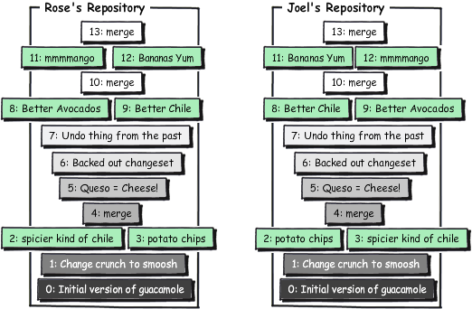
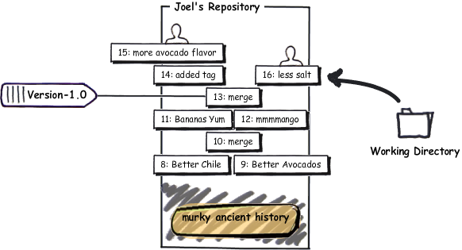
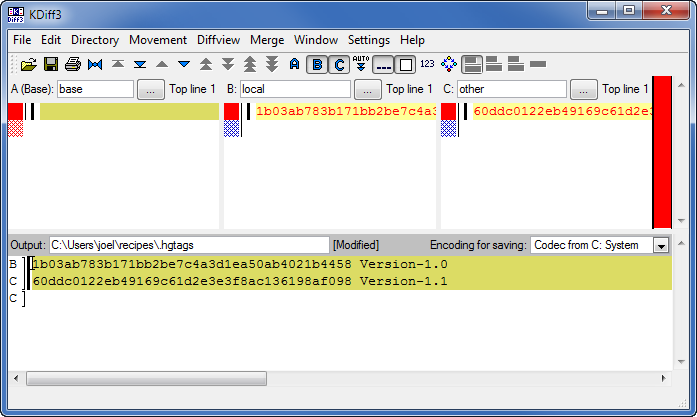
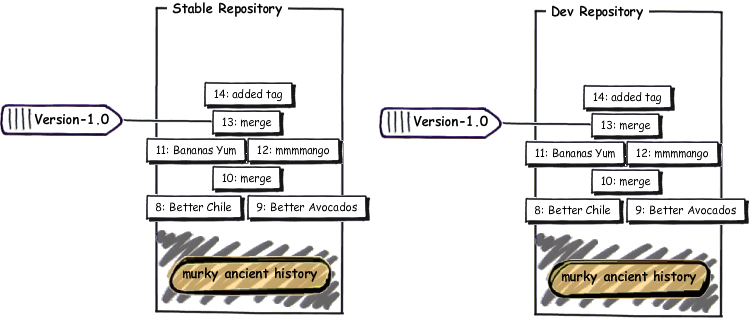
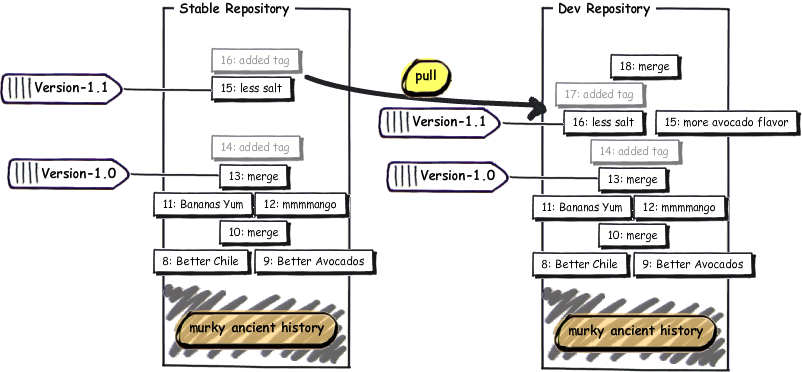
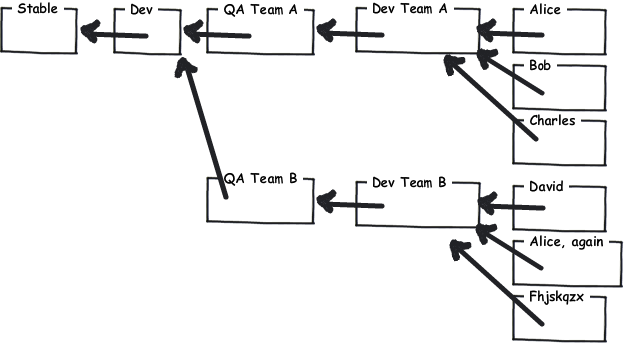

Our recipe is getting pretty good:

<pre><samp>
C:\Users\joel\recipes> <kbd>hg log -l 3</kbd>
changeset:   13:1b03ab783b17
tag:         tip
parent:      12:f923c9049234
parent:      11:0bd396c9b89b
user:        Rose Hillman &lt;rose@example.com&gt;
date:        Thu Feb 11 23:01:55 2010 -0500
summary:     merge

changeset:   12:f923c9049234
parent:      10:8646f8cd7154
user:        Rose Hillman &lt;rose@example.com&gt;
date:        Thu Feb 11 22:49:31 2010 -0500
summary:     mmmmango

changeset:   11:0bd396c9b89b
user:        Joel Spolsky &lt;joel@joelonsoftware.com&gt;
date:        Thu Feb 11 22:46:47 2010 -0500
summary:     bananas YUM
</samp></pre>

Let's look more closely at that changeset number:

<pre><samp>
changeset:   <strong>13</strong>:1b03ab783b17
</samp></pre>

The first part of the number, 13, is short and convenient. There's only one problem… it's not reliable!

When people on the team work separately and then merge their work, those short numbers get out of sync:

So, for all intents and purposes, I can't tell people "OK, let's ship the revision based on changeset 13", because they might have a different idea of what 13 is. That's why there's that crazy hexadecimal number.

<pre><samp>
changeset:   13:<strong>1b03ab783b17</strong>
</samp></pre>

The hexadecimal number _is_ consistent across all repositories and will never change.

OK, so now I could tell people, "Hey, we're shipping today! Changeset number 1b03ab783b17! Wouldn't it be nice if I could give this changeset a _name_?

Well, you can. It's called a **tag**.

<pre><samp>
C:\Users\joel\recipes> <kbd>hg tag Version-1.0</kbd>
</samp></pre>

Let's look at the log now:

<pre><samp>
C:\Users\joel\recipes> <kbd>hg log -l 2</kbd>
changeset:   14:1adc88356f40
tag:         tip
user:        Joel Spolsky &lt;joel@joelonsoftware.com&gt;
date:        Fri Feb 12 09:38:06 2010 -0500
summary:     Added tag Version-1.0 for changeset 1b03ab783b17

changeset:   13:1b03ab783b17
tag:         Version-1.0
parent:      12:f923c9049234
parent:      11:0bd396c9b89b
user:        Rose Hillman &lt;rose@example.com&gt;
date:        Thu Feb 11 23:01:55 2010 -0500
summary:     merge
</samp></pre>

Notice that the the very act of adding the tag was a changeset, and it got committed automatically for me. So now, every time I want to refer to the version of the code that we shipped, I can use **Version-1.0** instead of **1b03ab783b17**.

The CEO came down from the 31st floor for the office ship party, with a crate of rather expensive looking sparkling wine. Stan got a little bit drunk. Well, not a little. Nobody had ever seen anything like it. He was taking off his shirt, showing off his muscles and not insignificant flab, and trying to impress some women from the marketing department. "I'm gonna do pullups from the lights," he brags (we have these long fluorescent lights). So he jumps up, grabs the fixture, and of course, pulls down the whole thing immediately, since it was a ten pound light fixture hanging from a couple of thin pieces of piano wire, and his weight was somewhere in that hotly contested zone between 290 and 300 pounds. He pulls down the whole light and a lot of ceiling tiles, too, shattered glass and acoustic-tile-material everywhere, and lands smack on his tailbone whining about how he's going to sue the company for making an unsafe work environment.

The rest of us went back to our cubes, to work on Guac 2.0.

<section class="diff">
<h3>guac</h3>

<ins>GUACAMOLE 2.0 THIS IS GOING TO BE AWESOME</ins>  

* 2<ins>00</ins> ripe Hass avocados (not Haas) 
* 1/2 red onion, minced (about 1/2 cup) 
* 1-2 jalapeno chiles, stems and seeds removed, minced 
* 2 tablespoons cilantro leaves, finely chopped 
* 1 tablespoon of fresh lime or lemon juice 
* 1/2 teaspoon coarse salt 
* A dash of freshly grated black pepper 
* 1/2 ripe tomato, seeds and pulp removed, chopped 
* 1 ripe young Mango, in season. 
* 1 delicious, yellow BANANA. 

</section>

Commit:

<pre><samp>
C:\Users\joel\recipes> <kbd>hg com -m "more avocado flavor"</kbd>
</samp></pre>

Needless to say, the recipe here is in a very unsettled state. It hasn't been tested or anything. And then, the (one) customer calls up.

"It's too salty!" he whimpers. And no, he doesn't want to wait for version 2.0 for a fix.

Luckily, we've got that tag. I can use **hg up** to go to any version in the repository.

<pre><samp>
C:\Users\joel\recipes> <kbd>hg up -r Version-1.0</kbd>
1 files updated, 0 files merged, 1 files removed, 0 files unresolved

C:\Users\joel\recipes> <kbd>type guac</kbd>
* 2 ripe Hass avocados (not Haas)
* 1/2 red onion, minced (about 1/2 cup)
* 1-2 jalapeno chiles, stems and seeds removed, minced
...
</samp></pre>

And now I can fix his stupid salt problem:

<section class="diff">
<h3>guac</h3>

* 2 ripe Hass avocados (not Haas) 
* 1/2 red onion, minced (about 1/2 cup) 
* 1-2 jalapeno chiles, stems and seeds removed, minced 
* 2 tablespoons cilantro leaves, finely chopped 
* 1 tablespoon of fresh lime or lemon juice 
* <ins>1 grain table </ins>salt<ins>, split in half</ins> 
* A dash of freshly grated black pepper 
* 1/2 ripe tomato, seeds and pulp removed, chopped 
* 1 ripe young Mango, in season. 
* 1 delicious, yellow BANANA. 

</section>

And:

<pre><samp>
C:\Users\joel\recipes> <kbd>hg diff</kbd>
diff -r 1b03ab783b17 guac
--- a/guac      Thu Feb 11 23:01:55 2010 -0500
+++ b/guac      Fri Feb 12 10:44:19 2010 -0500
@@ -3,7 +3,7 @@
 * 1-2 jalapeno chiles, stems and seeds removed, minced
 * 2 tablespoons cilantro leaves, finely chopped
 * 1 tablespoon of fresh lime or lemon juice
-* 1/2 teaspoon coarse salt
+* 1 grain table salt, split in half
 * A dash of freshly grated black pepper
 * 1/2 ripe tomato, seeds and pulp removed, chopped
 * 1 ripe young Mango, in season.

C:\Users\joel\recipes> <kbd>hg com -m &quot;less salt&quot;</kbd>
created new head
</samp></pre>

Mercurial reminds me that I've created a new head. There are two heads now, the 2.0 head I was working on a second ago, and the 1.1 head I just committed.

Now I can ship this to my customer, tag it as 1.1, and go back to work on version 2.0.

<pre><samp>
C:\Users\joel\recipes> <kbd>hg tag -r . Version-1.1</kbd>

C:\Users\joel\recipes> <kbd>hg log -l 3</kbd>
changeset:   17:f4220e321145
tag:         tip
user:        Joel Spolsky &lt;joel@joelonsoftware.com&gt;
date:        Fri Feb 12 11:17:02 2010 -0500
summary:     Added tag Version-1.1 for changeset 60ddc0122eb4

changeset:   16:60ddc0122eb4
tag:         Version-1.1
parent:      13:1b03ab783b17
user:        Joel Spolsky &lt;joel@joelonsoftware.com&gt;
date:        Fri Feb 12 10:44:32 2010 -0500
summary:     less salt

changeset:   15:90c349eca2e8
user:        Joel Spolsky &lt;joel@joelonsoftware.com&gt;
date:        Fri Feb 12 10:31:24 2010 -0500
summary:     more avocado flavor

C:\Users\joel\recipes> <kbd>hg up -r 15</kbd>
2 files updated, 0 files merged, 0 files removed, 0 files unresolved

C:\Users\joel\recipes> <kbd>type guac</kbd>
GUACAMOLE 2.0 THIS IS GOING TO BE AWESOME

* 200 ripe Hass avocados (not Haas)
* 1/2 red onion, minced (about 1/2 cup)
* 1-2 jalapeno chiles, stems and seeds removed, minced
* 2 tablespoons cilantro leaves, finely chopped
* 1 tablespoon of fresh lime or lemon juice
* 1/2 teaspoon coarse salt
* A dash of freshly grated black pepper
* 1/2 ripe tomato, seeds and pulp removed, chopped
* 1 ripe young Mango, in season.
* 1 delicious, yellow BANANA.
...
</samp></pre>

Only one problem… the salt fix is not here. How do I solve that?

<pre><samp>
C:\Users\joel\recipes> <kbd>hg merge</kbd>
merging .hgtags
</samp></pre>

Uh oh. I have to merge the tags. This is an annoying bug in Mercurial. The problem is that tags in Mercurial are just a file, named .hgtags, which is also under version control, so occasionally, you have to manually merge different versions of the .hgtags file. Whenever that happens, what you have to do is easy… always keep BOTH versions of every line in the file.

<pre><samp>
merging guac
0 files updated, 2 files merged, 0 files removed, 0 files unresolved
(branch merge, don't forget to commit)

C:\Users\joel\recipes> <kbd>hg diff guac</kbd>
diff -r 90c349eca2e8 guac
--- a/guac      Fri Feb 12 10:31:24 2010 -0500
+++ b/guac      Fri Feb 12 11:32:43 2010 -0500
@@ -5,7 +5,7 @@
 * 1-2 jalapeno chiles, stems and seeds removed, minced
 * 2 tablespoons cilantro leaves, finely chopped
 * 1 tablespoon of fresh lime or lemon juice
-* 1/2 teaspoon coarse salt
+* 1 grain table salt, split in half
 * A dash of freshly grated black pepper
 * 1/2 ripe tomato, seeds and pulp removed, chopped
 * 1 ripe young Mango, in season.

C:\Users\joel\recipes> <kbd>hg com -m "bringing in salt fix from 1.1"</kbd>
</samp></pre>

This simple method of going back to old, tagged versions is fine for when you just want to make one little unexpected fix to shipping code. But the truth is, in most software projects, this kind of stuff happens all the time, and Mercurial has a more robust way to deal with it.

So I'm just going to undo all that post-1.0 work, and get the repository back to the way it was when I had just shipped 1.0, and then I can show you the fancy robust way to fix existing customers' bugs while working on a future version at the same time.

<pre><samp>
C:\Users\joel\recipes> <kbd>cd ..</kbd>

C:\Users\joel> <kbd>hg clone -r 14 recipes recipes-stable</kbd>
requesting all changes
adding changesets
adding manifests
adding file changes
added 15 changesets with 15 changes to 2 files
updating to branch default
2 files updated, 0 files merged, 0 files removed, 0 files unresolved

C:\Users\joel> <kbd>cd recipes-stable</kbd>

C:\Users\joel\recipes-stable <kbd>hg log -l 3</kbd>
changeset:   14:1adc88356f40
tag:         tip
user:        Joel Spolsky &lt;joel@joelonsoftware.com&gt;
date:        Fri Feb 12 09:38:06 2010 -0500
summary:     Added tag Version-1.0 for changeset 1b03ab783b17

changeset:   13:1b03ab783b17
tag:         Version-1.0
parent:      12:f923c9049234
parent:      11:0bd396c9b89b
user:        Rose Hillman &lt;rose@example.com&gt;
date:        Thu Feb 11 23:01:55 2010 -0500
summary:     merge

changeset:   12:f923c9049234
parent:      10:8646f8cd7154
user:        Rose Hillman &lt;rose@example.com&gt;
date:        Thu Feb 11 22:49:31 2010 -0500
summary:     mmmmango
</samp></pre>

The idea is that instead of doing everything in one repository, we're going to make two repositories, one called **stable** and the other called **dev**.

The **stable** repository holds the last major version of the code that we shipped to customers. Whenever you need to make an urgent bug fix, you do it in **stable**. In this example it's going to be all the patches to 1.0.

The **dev** repository is where the next major train of development is happening, leading up to 2.0.

As soon as 1.0 ships, I'm going to clone **stable** to **dev**:

<pre><samp>
C:\Users\joel\recipes-stable <kbd>cd ..</kbd>

C:\Users\joel> <kbd>hg clone recipes-stable recipes-dev</kbd>
updating to branch default
2 files updated, 0 files merged, 0 files removed, 0 files unresolved
</samp></pre>

Now I have two identical repositories:

Since the history of both of these repositories is the same up to changeset 14, Mercurial will actually use a file system trick called hard links to avoid making two copies on disk. That makes the **hg clone** operation fast and cheap, so you shouldn't hesitate to make lots and lots and lots of clones.

Now we start working on that guac in the **dev** repository:

<pre><samp>
C:\Users\joel> <kbd>cd recipes-dev</kbd>

C:\Users\joel\recipes-dev>  <kbd>edit guac</kbd>

C:\Users\joel\recipes-dev>  <kbd>hg diff</kbd>
diff -r 1adc88356f40 guac
--- a/guac      Fri Feb 12 09:38:06 2010 -0500
+++ b/guac      Fri Feb 12 15:15:01 2010 -0500
@@ -1,4 +1,6 @@
-* 2 ripe Hass avocados (not Haas)
+GUACAMOLE 2.0 THIS IS GOING TO BE AWESOME
+
+* 200 ripe Hass avocados (not Haas)
 * 1/2 red onion, minced (about 1/2 cup)
 * 1-2 jalapeno chiles, stems and seeds removed, minced
 * 2 tablespoons cilantro leaves, finely chopped

C:\Users\joel\recipes-dev> <kbd>hg commit -m &quot;more avocado flavor&quot;</kbd>
</samp></pre>

And fix the salt problem in the stable repository:

<pre><samp>
C:\Users\joel\recipes-dev>  <kbd>cd ..\recipes-stable</kbd>

C:\Users\joel\recipes-stable>  <kbd>edit guac</kbd>

C:\Users\joel\recipes-stable>  <kbd>hg diff</kbd>
diff -r 1adc88356f40 guac
--- a/guac      Fri Feb 12 09:38:06 2010 -0500
+++ b/guac      Fri Feb 12 15:18:31 2010 -0500
@@ -3,7 +3,7 @@
 * 1-2 jalapeno chiles, stems and seeds removed, minced
 * 2 tablespoons cilantro leaves, finely chopped
 * 1 tablespoon of fresh lime or lemon juice
-* 1/2 teaspoon coarse salt
+* 1 grain table salt, split in half
 * A dash of freshly grated black pepper
 * 1/2 ripe tomato, seeds and pulp removed, chopped
 * 1 ripe young Mango, in season.

C:\Users\joel\recipes-stable>  <kbd>hg com -m "less salt"</kbd>
</samp></pre>

I'll tag that and ship it as 1.1:

<pre><samp>
C:\Users\joel\recipes-stable>  <kbd>hg tag Version-1.1</kbd>
</samp></pre>

And now, every once in a while, we pull in the fixes from stable to dev:

<pre><samp>
C:\Users\joel\recipes-stable>  <kbd>cd ..\recipes-dev</kbd>

C:\Users\joel\recipes-dev>  <kbd>hg in</kbd>
comparing with c:\Users\joel\recipes-stable
searching for changes
changeset:   15:e05c954f961f
tag:         Version-1.1
user:        Joel Spolsky &lt;joel@joelonsoftware.com&gt;
date:        Fri Feb 12 15:28:27 2010 -0500
summary:     less salt

changeset:   16:f0e8768829ed
tag:         tip
user:        Joel Spolsky &lt;joel@joelonsoftware.com&gt;
date:        Fri Feb 12 15:28:40 2010 -0500
summary:     Added tag Version-1.1 for changeset e05c954f961f

C:\Users\joel\recipes-dev> <kbd>hg pull</kbd>
pulling from c:\Users\joel\recipes-stable
searching for changes
adding changesets
adding manifests
adding file changes
added 2 changesets with 2 changes to 2 files (+1 heads)
(run 'hg heads' to see heads, 'hg merge' to merge)

C:\Users\joel\recipes-dev> <kbd>hg merge</kbd>
merging guac
0 files updated, 1 files merged, 0 files removed, 0 files unresolved
(branch merge, don't forget to commit)

C:\Users\joel\recipes-dev> <kbd>hg com -m &quot;merge&quot;</kbd>

C:\Users\joel\recipes-dev> <kbd>type guac</kbd>
GUACAMOLE 2.0 THIS IS GOING TO BE AWESOME

* 200 ripe Hass avocados (not Haas)
* 1/2 red onion, minced (about 1/2 cup)
* 1-2 jalapeno chiles, stems and seeds removed, minced
* 2 tablespoons cilantro leaves, finely chopped
* 1 tablespoon of fresh lime or lemon juice
* 1 grain table salt, split in half
* A dash of freshly grated black pepper
* 1/2 ripe tomato, seeds and pulp removed, chopped
* 1 ripe young Mango, in season.
* 1 delicious, yellow BANANA.

Smoosh all ingredients together.
Serve with tortilla chips.
</samp></pre>

Here's what we've been doing:

And, if you can understand _that_ crazy graph, you're well on your way to understanding Mercurial. The gist of it is that eventually the stable repository only has the bug fixes, while the dev repository has new code and bug fixes merged in.

There are other ways you can use multiple repositories.

- You can set up a team repository where a few people work on a feature together. When they are finished and the feature works well, you push the changes from the team repository to the main development repository, and then everyone else sees it.
- You can set up a QA repository for the testers. Instead of pushing into the main repository, you push into the QA repository where your code is tested. Once the testers approve it, you push from the QA repository into the main development repository. That way the main repository always contains tested code.
- Since each developer has their own repository, you can pull an experimental changeset from your friend to test it, without inflicting that change on the rest of the team.

In large, complicated organizations, you can combine these techniques, setting up a bunch of repositories that pull from each other. As each feature goes through testing and integration, it gets pulled up higher and higher in the tree until eventually the new code is in the main shipping repository where customers can get it:

## Test yourself

Here are the things you should know how to do after reading this tutorial:

1. Tag old versions and go back to them
2. Organize your team with "stable" and "dev" repositories

Well, somehow we've reached the end of this tutorial. I haven't even come _close_ to covering everything in Mercurial, but there are plenty of resources to go more in depth.
There's [a book](http://hgbook.red-bean.com/) that covers everything in utter and complete detail.
